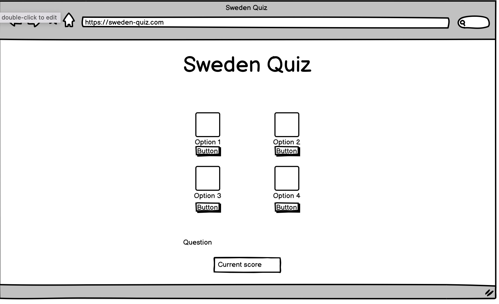

# Sweden Quiz 

The live website can be viewed [here](https://chapter256.github.io/sweden-quiz/).

## User Experience (UX)

- ### User Stories 

  1. As a user, I want to test my knowledge of Sweden. 
  2. As a user, I want to choose from a range of answers. 
  3. As a user, I want to see my score to know if I passed or failed the quiz.

- ### Design
  - #### Colour scheme 
  - Used for background colour of header: 
  
  - Used as background for main page as well as buttons: 
  
  
I choose these colours as they represent the Swedish flag. We also have black and white for text and container background. 

#### Wireframe

## Features
Sweden Quiz is a quick and easy quiz to test your knowledge of Sweden. It's a single player quiz that has a total of ten questions that revolve around Sweden. the player will have two or four options on each question and can only pick one answer. At the end of the quiz the user will get their total score, passing point is six.

### Landing Page 
**The main page**
* Has a header that comprises of the sites name. 
* Has a "Start" button that the player can use to start the quiz. 
* A "How to play" button where the user can get more information on how to play the game. Once the user presses this button a new screen appears with a short summery of the gameplay. 

#### Quiz section 
* The user will press the "Start" button to start the quiz. A randomized question will appear where the user gets to choose one answer. Once the user has pressed their answer a "Next" button will appear to the right where the user can submit their answer and move on to the next question. If the user would like to change their answer, they can do so before pressing the next button. Once the user has gone through all the questions a "Restart" button will appear. 

### Future Features 
* Countdown Timer
* A leaderboard where the player can save their score and see others scores
* Head to head remote play 

## Technologies Used 
### Languages
- HTML was used to create the content of the webpage 
- CSS was used to style the webpage as well as specify the layout. 
- JavaScript was used to create the interactions between the user and the webpage. 
### Programmes used
- Balsamiq was used to create the wireframe. 
- Gitpod was used as an editior to write and run the code. 
- Github was used as a software hosting platform to keep the project in a remote location.
- Chrome developer tools was used for troubleshooting and checking compability. 
- Am I responsive was used to test if the website was responsive on different screen sizes.
- Font Awesome and Google font was used for font resource. 

## Testing and Validation
I used the W3C Validator and W3C CSS Validator to validate my website.

### Lighthouse
- Website was tested using Lighthouse

### Devices
- Website was tested using Chrome and Safari.
- The website was tested on my iMac and Macbook pro. 
- 
### Testing User Stories 

## Deployment 

- Github was used to deploy the project. Following the steps below: 
1. Log onto your GitHub and locate the GitHub repositor.
2. Navigate to the Settings, navigate to the left to the Pages 
3. From the source section drop-down menu, select the main branch
4. Once the main branch has been selected, the page will be automatically refreshed with a detailed ribbon display to indicate the successful deployment.

## Credits
* Build a Quiz App - [Youtube playlist](https://www.youtube.com/watch?v=u98ROZjBWy8&list=PLDlWc9AfQBfZIkdVaOQXi1tizJeNJipEx&index=1&ab_channel=JamesQQuick), tutorial that I followed and took inspiration from. 
* Build A Quiz App With JavaScript - [Youtube video](https://www.youtube.com/watch?v=riDzcEQbX6k&t=236s&ab_channel=WebDevSimplified), tutorial that I followed and took inspiration from. 

### Acknowledgments: 
- Code Institute for course material and content 
- My friend, Chris Tucker for assisting me whenever I needed help or guidance with my project. 
